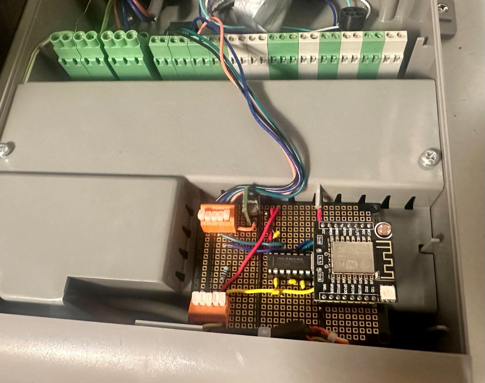
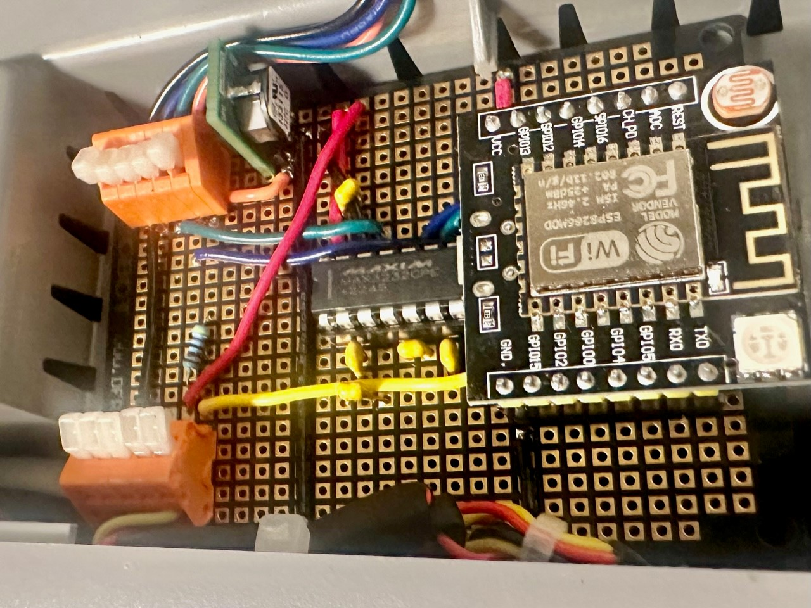
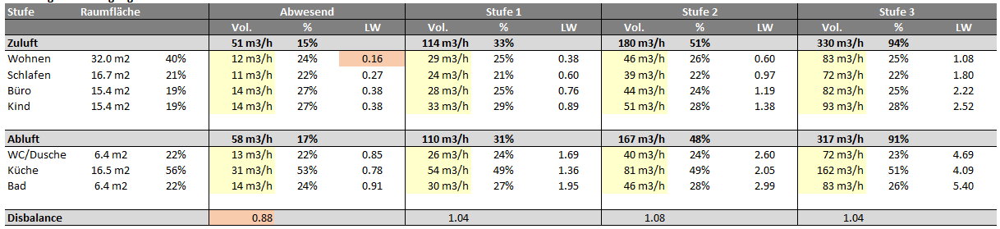
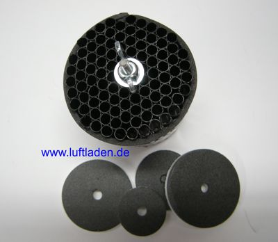
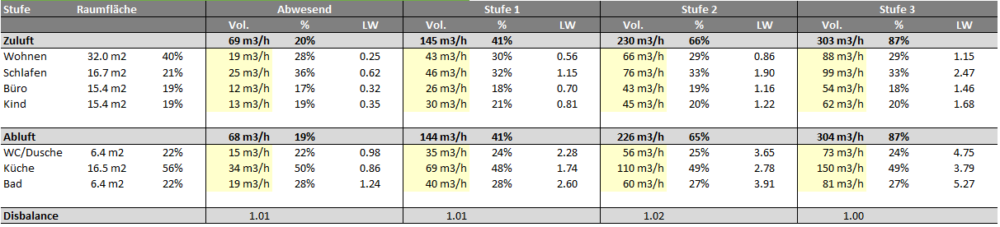
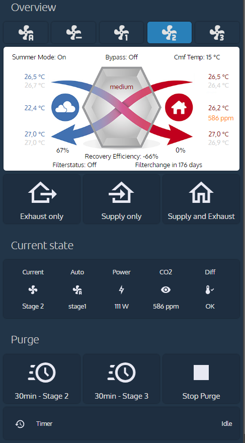

# esphome-comfoair
This is a fork of https://github.com/ItsEcholot/esphome-comfoair which originates in https://github.com/wichers/esphome-comfoair

This implementation is great because it allows the supply air fan to be deactivated with a Home Assistant service call. This is great for cooling at night in summer when the windows are opened and the outside temperature is low enough.

Changes in this fork:
1. Adapted Code to work with ESPHome version 2023.8.1 (see https://github.com/esphome/issues/issues/4553):
   - removed sensor name in constructor e.g. `... = new Sensor("Comfoair Return Air Level")` -> `... = new Sensor()`
   - added `set_object_id` and `set_name` for all sensors e.g.
     `ca->return_air_level->set_object_id("Comfoair Return Air Level");`
		 `ca->return_air_level->set_name("Comfoair Return Air Level");`
1. Added four Dallas Temperature Sensors because internal ones failed several times because of corroded contacts.
1. Added Home Assistant Service to reset the filter timer in the comfoair
1. Added "setting default levels" at ESP32 startup. Otherwise, if the esp gets restarted or reflashed in e.g. extract only mode, the levels are lost because they got set to 0.
		 
## Building the thing

### Part list

1. ESP8266 serial WIFI Witty cloud Development Board ESP-12F module MINI nodemcu [buy here](https://www.aliexpress.com/item/32832264128.html)
1. MAX3232CPE+ [buy here](https://ch.farnell.com/analog-devices/max3232cpe/transceiver-3232-dip16/dp/2519372?CMP=i-ddd7-00001003)
1. DIP Socket 16POS [buy here](https://www.digikey.ch/de/products/detail/cnc-tech/243-16-1-03/3441570)
1. Ceramic Capacitors 0.1 µF [buy here](https://www.digikey.ch/de/products/detail/vishay-beyschlag-draloric-bc-components/K104K15X7RF5TL2/286538)
1. Breadboard with VCC and GND lines [buy here](https://www.digikey.ch/de/products/detail/dfrobot/FIT0203/6588423)
1. PCB Terminal Block 5 Pos [buy here](https://www.digikey.ch/de/products/detail/dfrobot/FIT0203/6588423)
1. DC/DC Converter 3.3V [buy here](https://www.digikey.ch/de/products/detail/murata-power-solutions-inc/OKI-78SR-3-3-1-5-W36-C/2259780)

### Useful documents
Attention, the schematic is not updated and does not include the four dallas sensors with the 4.7 kOhm resistor. Initially I wanted to create the Ease-Proxy-solution from https://github.com/julianpas/esphome-comfoair . But because I could use the pins for the Dallas sensors, finally the MAX3232CPE+ is now used only for one serial connection. That's the reason why I used this schematic.


[RS232 protocol description comfoair](doc/protocol_description_ComfoAir_german.pdf)
[Zehnder Comfoair 350 installer manual german](doc/comfoair350_installer_manual_de.pdf)
[Zehnder Comfoair 350 installer manual english](doc/comfoair350_installer_manual_en.pdf)

### Assembly




### Flash the ESP8266
The WIFI Witty cloud Development Board consists of two pieces
1. upper board with one switch and the ESP
1. lower board with two buttons

To perform flashing, I had to connect both boards and plug the USB cable into the lower board.

The final installation only includes the lower board.


## Air volume balancing
To ensure that each room receives the correct amount of air, volume flow balancing is essential. Unfortunately, this adjustment is carried out correctly in very few cases.

The document [KwlLüftunsmessungenWohnung.xlsx](doc/KwlLüftunsmessungenWohnung.xlsx) includes some thoughts about the correct volume air flow rates for my appartment. The values are from this book [Komfortlüftung in Wohngebäuden, Heinrich Huber](https://www.orellfuessli.ch/shop/home/artikeldetails/A1036104051).

Procedure
1. define plan/target values for each room
2. measure the current volume flow
3. installation of flow restrictors
4. measure again, adjust the restrictors again

Findings from my flat
- Disbalance between exhaust and supply air either too high or too low per room (there should be a constant small overpressure, i.e. the supply air fan should bring in more air than the exhaust air fan)
- little air flows from kitchen into bedroom, bad because of taste transfer
- Sleeping room has far too little air at stage 1, living room also has relatively little, children's room and office rather a lot because these rooms are close to the ventilation unit and the ducts are short
- Toilet/Shower has too little air, 35m3/h should be because of the washing machine/tumbler



In order to set the volume flows correctly, I rented a [flow anemometer, e.g.](https://www.woehler.de/services/aktuelles/presse/artikel/damit-die-anlage-so-funktioniert-wie-sie-soll-volumenstroeme-fachmaennisch-einstellen/) and installed these [flow restrictors](https://www.luftladen.com/luftmengendrossel-967/)



After a time-consuming series of measurements, I was able to achieve the required volume flows (which should actually have already been present when the house was commissioned...)



My comfoair settings after the air volume flow measurements

| Stage              | Off/Unoccupied | Stage 1 (normal level) | Stage 2 (increased level) | Stage 3 (intensive level) |
|--------------------|:--------------:|:----------------------:|:-------------------------:|:-------------------------:|
| Supply Ventilator  |       26%      |           47%          |            74%            |            100%           |
| Exhaust Ventilator |       24%      |           43%          |            68%            |            91%            |


## Home Assistant Template Sensor for Temperature Difference Alarm
The ComfoAir temperature sensors were experiencing problems due to corroded contacts. This was bad, because the bypass never opened because of that...

The problem was solved by loosening and retightening the temperature sensor cables on the circuit board.

In order to detect faulty sensors in the future, four more temperature sensors were installed in parallel with the existing ones so that the values can be compared with the following template. 

```yaml
# Temperature Sensor Error Ventilation (if difference between sensors is detected)
template:
  - binary_sensor:
    - name: central_ventilation_temperature_sensor_error
        state: >
          {% set error = {
            "aul": ((states('sensor.ca350_outside_temp') | float(0) - states('sensor.central_ventilation_temp_aul_esp8266') | float(0)) | abs > 1),
            "zul": ((states('sensor.ca350_supply_temp') | float(0) - states('sensor.central_ventilation_temp_zul_esp8266') | float(0)) | abs > 1),
            "abl": ((states('sensor.ca350_return_temp') | float(0) - states('sensor.central_ventilation_temp_abl_esp8266') | float(0)) | abs > 1),
            "fol": ((states('sensor.ca350_exhaust_temp') | float(0) - states('sensor.central_ventilation_temp_fol_esp8266') | float(0)) | abs > 1)
          } %}
           true  false 
        device_class: problem
        icon: >
           mdi:thermometer-alert
           mdi:thermometer-check
          
```

## Dashboard Visualization



```yaml
type: picture-elements
image: local/comfoair/base.png
elements:
  - type: state-label
    entity: sensor.ca350_fanex_perc
    style:
      top: 83%
      left: 25%
      color: black
  - type: state-label
    entity: sensor.ca350_fansu_perc
    style:
      top: 83%
      left: 75%
      color: black
  - type: state-label
    entity: sensor.ca350_return_temp
    style:
      top: 24%
      left: 97%
      color: darkred
      transform: translate(-100%, -50%)
  - type: state-label
    entity: sensor.central_ventilation_temp_abl_esp8266
    style:
      top: 31%
      left: 97%
      color: lightgrey
      transform: translate(-100%, -50%)
    transform: none
  - type: state-label
    entity: sensor.central_aqual
    style:
      top: 57%
      left: 99%
      color: darkorange
      transform: translate(-100%, -50%)
  - type: state-label
    entity: sensor.central_temp
    style:
      top: 49%
      left: 97%
      color: darkred
      transform: translate(-100%, -50%)
  - type: state-label
    entity: sensor.ca350_supply_temp
    style:
      top: 70%
      left: 97%
      color: darkred
      transform: translate(-100%, -50%)
  - type: state-label
    entity: sensor.central_ventilation_temp_zul_esp8266
    style:
      top: 77%
      left: 97%
      color: lightgrey
      transform: translate(-100%, -50%)
  - type: state-label
    entity: sensor.ca350_outside_temp
    style:
      top: 24%
      left: 19%
      color: '#4171b1'
      transform: translate(-100%, -50%)
  - type: state-label
    entity: sensor.central_ventilation_temp_aul_esp8266
    style:
      top: 31%
      left: 19%
      color: lightgrey
      transform: translate(-100%, -50%)
  - type: state-label
    entity: sensor.central_outside_temp
    style:
      top: 49%
      left: 19%
      color: '#4171b1'
      transform: translate(-100%, -50%)
  - type: state-label
    entity: sensor.ca350_exhaust_temp
    style:
      top: 70%
      left: 19%
      color: '#4171b1'
      transform: translate(-100%, -50%)
  - type: state-label
    entity: sensor.central_ventilation_temp_fol_esp8266
    style:
      top: 77%
      left: 19%
      color: lightgrey
      transform: translate(-100%, -50%)
  - type: state-label
    entity: binary_sensor.ca350_summer_mode
    prefix: 'Summer Mode: '
    style:
      top: 8%
      left: 15%
      color: black
  - type: state-label
    entity: binary_sensor.ca350_bypass_open
    prefix: 'Bypass: '
    style:
      top: 8%
      left: 50%
      color: black
  - type: state-label
    entity: climate.comfoair_350
    attribute: temperature
    prefix: 'Cmf Temp: '
    suffix: ' °C'
    style:
      top: 8%
      left: 82%
      color: black
  - type: state-label
    entity: climate.comfoair_350
    attribute: fan_mode
    style:
      top: 32%
      left: 50%
      color: darkred
  - type: state-label
    entity: sensor.central_ventilation_heat_recovery_coefficient
    prefix: 'Recovery Efficiency: '
    style:
      top: 88%
      left: 50%
      color: black
  - type: state-label
    entity: sensor.air_filter_days_remaining
    prefix: 'Filterchange in '
    style:
      top: 95%
      left: 70%
      color: black
  - type: state-label
    entity: binary_sensor.ca350_filter
    prefix: 'Filterstatus: '
    style:
      top: 95%
      left: 30%
      color: black

```

