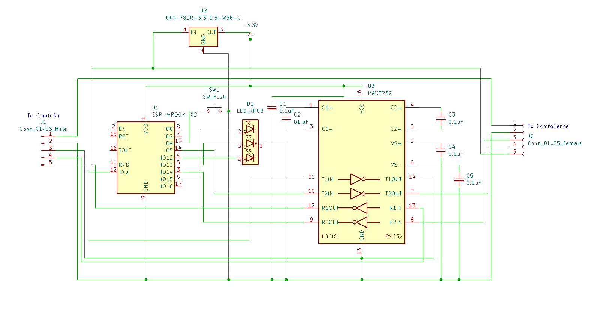

# esphome-comfoair
This is a fork of https://github.com/ItsEcholot/esphome-comfoair which originates in https://github.com/wichers/esphome-comfoair

Changes in this fork:
1. Adapted Code to work with ESPHome version 2023.8.1 (see https://github.com/esphome/issues/issues/4553):
   - removed sensor name in constructor e.g. `... = new Sensor("Comfoair Return Air Level")` -> `... = new Sensor()`
   - added `set_object_id` and `set_name` for all sensors e.g.
     `ca->return_air_level->set_object_id("Comfoair Return Air Level");`
		 `ca->return_air_level->set_name("Comfoair Return Air Level");`
1. Added four Dallas Temperature Sensors because internal ones failed several times because of corroded contacts. 
		 
## Building the thing

### Part list

1. ESP8266 serial WIFI Witty cloud Development Board ESP-12F module MINI nodemcu [buy here](https://www.aliexpress.com/item/32832264128.html)
1. MAX3232CPE+ [buy here](https://ch.farnell.com/analog-devices/max3232cpe/transceiver-3232-dip16/dp/2519372?CMP=i-ddd7-00001003)
1. DIP Socket 16POS [buy here](https://www.digikey.ch/de/products/detail/cnc-tech/243-16-1-03/3441570)
1. Ceramic Capacitors 0.1 µF [buy here](https://www.digikey.ch/de/products/detail/vishay-beyschlag-draloric-bc-components/K104K15X7RF5TL2/286538)
1. Breadboard with VCC and GND lines [buy here](https://www.digikey.ch/de/products/detail/dfrobot/FIT0203/6588423)
1. PCB Terminal Block 5 Pos [buy here](https://www.digikey.ch/de/products/detail/dfrobot/FIT0203/6588423)
1. DC/DC Converter 3.3V [buy here](https://www.digikey.ch/de/products/detail/murata-power-solutions-inc/OKI-78SR-3-3-1-5-W36-C/2259780)

### Useful documents
Attention, the schematic is not updated and does not include the four dallas sensors with the 4.7 kOhm resistor. Initially I wanted to create the Ease-Proxy-solution from https://github.com/julianpas/esphome-comfoair . But because I could use the pins for the Dallas sensors, finally the MAX3232CPE+ is now used only for one serial connection. That's the reason why I used this schematic.




### Assembly


### Flash the ESP8266
The WIFI Witty cloud Development Board consists of two pieces
1. upper board with one switch and the ESP
1. lower board with two buttons

To perform flashing, I had to connect both boards and plug the USB cable into the lower board.

The final installation only includes the lower board.

### Home Assistant Template Sensor for Temperature Difference Alarm
The ComfoAir temperature sensors were experiencing problems due to corroded contacts. The problem was solved by loosening and retightening the temperature sensor cables on the circuit board. In order to detect faulty sensors in the future, four more temperature sensors were installed in parallel with the existing ones so that the values can be compared with the following template. 

```yaml
# Temperature Sensor Error Ventilation (if difference between sensors is detected)
template:
	- binary_sensor:
			- name: central_ventilation_temperature_sensor_error
				state: >
					{% set error = {
						"aul": ((states('sensor.ca350_outside_temp') | float(0) - states('sensor.central_ventilation_temp_aul_esp8266') | float(0)) | abs > 1),
						"zul": ((states('sensor.ca350_supply_temp') | float(0) - states('sensor.central_ventilation_temp_zul_esp8266') | float(0)) | abs > 1),
						"abl": ((states('sensor.ca350_return_temp') | float(0) - states('sensor.central_ventilation_temp_abl_esp8266') | float(0)) | abs > 1),
						"fol": ((states('sensor.ca350_exhaust_temp') | float(0) - states('sensor.central_ventilation_temp_fol_esp8266') | float(0)) | abs > 1)
					} %}
					 true  false 
				device_class: problem
				icon: >
					 mdi:thermometer-alert
					 mdi:thermometer-check
					
```